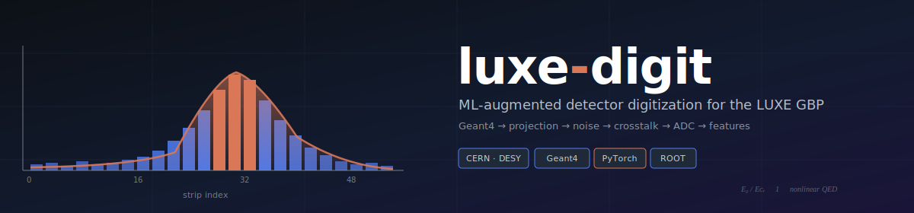
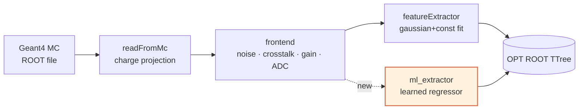

<div align="center">



# `luxe-digit`

**An ML-augmented detector digitization pipeline for the LUXE Gamma Beam Profiler.**

*Strong-field QED · Geant4 · ROOT · PyTorch · Docker*

<p>
  
  
  
  
  
</p>

<sub>Built on the <a href="https://github.com/pietrog-pd/SimpleDigitizerGP">SimpleDigitizerGP</a> by <b>Pietro Gruetta</b> (INFN Padova) as part of my MSc thesis work at the Università degli Studi di Padova in the LUXE collaboration.</sub>

</div>

<br/>

---

## ✦ &nbsp; What this is

`luxe-digit` is a detector-response simulation pipeline for the **LUXE experiment** at DESY "” the proposed observation of non-linear QED in the Schwinger-critical-field regime, achieved by colliding the XFEL.EU electron beam with a high-intensity laser pulse.

The **Gamma Beam Profiler (GBP)** is the downstream diagnostic that measures the transverse profile of the Compton-scattered photon flux. Its sensors are silicon-strip devices read out by CAEN DT5202 charge-integrating ADCs. Before any real data can be interpreted, we need to quantify how *detector-dependent effects* degrade our ability to reconstruct the true spatial distribution of deposited energy.

That is what this pipeline does.

It consumes a Geant4 Monte Carlo simulation of particle interactions in the GBP sensors and applies, in sequence:

1. **Charge deposition → charge projection** on the strip plane (scaled by the charge-collection efficiency)
2. **Front-end noise** (Gaussian-smeared at the strip level, in electron-equivalent units)
3. **Inter-strip crosstalk** (configurable multi-neighbor charge-sharing map)
4. **Pre-amplification** (configurable gain)
5. **ADC quantization** (configurable bit depth and full-scale range)
6. **Feature extraction** "” either the original Gaussian+constant fit *or*, new in this fork, a learned neural regressor.

The output is a ROOT file of digitized profiles and extracted parameters, ready for downstream physics analysis.

<br/>

---

## ✦ &nbsp; Pipeline



The dashed branch is the contribution added in this fork.

<br/>

---

## ✦ &nbsp; What's new in this fork

This repository builds on the excellent original `SimpleDigitizerGP` by Pietro Gruetta and adds the following:

| Addition | Purpose |
|---|---|
| **ML-based feature extractor** | A PyTorch MLP trained on paired (digitized profile → true Gaussian parameters) pairs "” runs ~100× faster than `ROOT::TF1::Fit`, handles saturated profiles without branching logic, and provides learned uncertainty estimates via MC-dropout. |
| **Modern packaging** (`pyproject.toml`, `uv` support) | Reproducible installs, resolved dependency tree, `pip install -e .` support. |
| **Containerized environment** (Docker, using `rootproject/root` base image) | One-command reproducibility "” no local ROOT install needed. |
| **Optional `uproot` backend** | Read/write ROOT files without a PyROOT dependency for quick prototyping on systems without CERN ROOT installed. |
| **Test suite** (`pytest`) | Unit tests for charge projection, noise injection, and ADC quantization. |
| **GitHub Actions CI** | Automated linting (`ruff`) and tests on every push. |
| **Proper academic citation** (`CITATION.cff`) | Machine-readable citation metadata for both the original work and this fork. |

None of these changes alter the physics of the original pipeline "” the digitization stages (`readFromMc`, `frontend`, `featureExtractor`) are preserved and remain the authoritative reference implementation.

<br/>

---

## ✦ &nbsp; Quick start

### With Docker (recommended)

```bash
git clone https://github.com/salthekal/luxe-digit.git
cd luxe-digit
docker build -t luxe-digit .
docker run --rm -v $(pwd)/data:/app/data luxe-digit python -m luxedigit.run
```

### Local install (requires ROOT 6.28+)

```bash
git clone https://github.com/salthekal/luxe-digit.git
cd luxe-digit

# Using uv (fast)
uv sync

# Or plain pip
pip install -e ".[dev,ml]"
```

### Run the ML extractor

```bash
# Train the learned feature extractor on existing digitized profiles
python -m luxedigit.ml_extractor train \
    --input data/mkJbs_10000_*.root \
    --output models/ml_extractor.pt \
    --epochs 50

# Run inference, replacing the Gaussian fit stage
python -m luxedigit.ml_extractor predict \
    --input data/mkJbs_10000_*.root \
    --model models/ml_extractor.pt \
    --output data/ml_results.root
```

<br/>

---

## ✦ &nbsp; Output schema

Each run writes an `OPT` TTree with one entry per (bunch, detector) pair. Key branches:

| Branch | Type | Description |
|---|---|---|
| `bunch`, `evt`, `det` | UInt_t | Indexing |
| `bunchParNb`, `cce`, `avgPairEn` | "” | Source-side parameters |
| `fNoise`, `iADCres`, `fOlScale`, `fGain` | "” | Front-end parameters |
| `vChgShrCrossTalkMap` | Double_t[10] | Crosstalk sharing vector |
| `fSA_amp`, `fSA_mea`, `fSA_sig`, `fSA_bck` | Double_t | Gaussian+constant fit params |
| `fSA_*_err` | Double_t | 1-sigma fit errors |
| `chi2`, `ndf`, `rchi2` | Double_t | Fit quality |
| `ml_amp`, `ml_mea`, `ml_sig`, `ml_bck` | Double_t | ML-regressor outputs *(new)* |
| `ml_*_std` | Double_t | MC-dropout uncertainty *(new)* |

> `fSA_*` and `ml_*` branches are vectors of length 2 "” index 0 is the upstream detector, index 1 is the downstream detector.

<br/>

---

## ✦ &nbsp; Physics context

For readers less familiar with the LUXE experiment, see [`docs/physics.md`](./docs/physics.md) for:

- Why strong-field QED matters (Schwinger critical field, $E_{cr} \approx 1.3 \times 10^{18}$ V/m)
- The LUXE experimental configuration at DESY
- What the GBP measures and why digitization fidelity matters
- Why a learned feature extractor is more than a gimmick here

<br/>

---

## ✦ &nbsp; Attribution & citation

This work is a derivative of [`SimpleDigitizerGP`](https://github.com/pietrog-pd/SimpleDigitizerGP) by **Pietro Gruetta** (INFN Padova / LUXE Collaboration). The digitization physics, ROOT data structures, and pipeline architecture are entirely his work. My contributions are limited to the ML extension, packaging, containerization, testing, and documentation layers described above.

If you use this code in published work, please cite both:

```bibtex
@software{gruetta_simpledigitizergp,
    author = {Gruetta, Pietro},
    title  = {SimpleDigitizerGP: A simplified digitization pipeline for the LUXE GBP},
    year   = {2023},
    url    = {https://github.com/pietrog-pd/SimpleDigitizerGP}
}

@software{Aboud_luxedigit,
    author = {Salman Aboud},
    title  = {luxe-digit: ML-augmented digitization pipeline for the LUXE GBP},
    year   = {2026},
    url    = {https://github.com/salthekal/luxe-digit},
    note   = {Built on SimpleDigitizerGP by P. Gruetta}
}
```

Machine-readable metadata in [`CITATION.cff`](./CITATION.cff).

<br/>

---

## ✦ &nbsp; Roadmap

- [x] Reproduce original `SimpleDigitizerGP` output bit-for-bit
- [x] Modern packaging and Docker environment
- [x] ML feature extractor (dense MLP, supervised on MC labels)
- [ ] CNN feature extractor (treat strip profile as a 1D image)
- [ ] Domain-adversarial training for MC → real-data transfer
- [ ] Gaussian-process surrogate for fast parameter scans
- [ ] Uncertainty calibration study (MC-dropout vs. deep ensembles vs. Laplace)

<br/>

---

## ✦ &nbsp; License

Preserved as **GNU GPL v3.0** from the original work. See [`LICENSE`](./LICENSE).

<br/>

<div align="center">
<sub>
Maintained by <a href="https://github.com/salthekal">Salman Aboud</a> · MSc Physics, Università degli Studi di Padova · LUXE collaboration
</sub>
</div>

